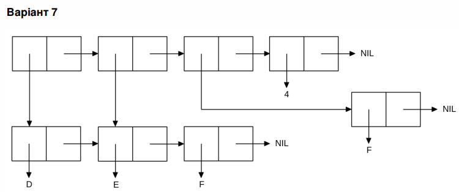

<p align="center"><b>МОНУ НТУУ КПІ ім. Ігоря Сікорського ФПМ СПіСКС</b></p>
<p align="center">
<b>Звіт з лабораторної роботи 1</b><br/>
"Обробка списків з використанням базових функцій"<br/>
дисципліни "Вступ до функціонального програмування"
</p>
<p align="right"><b>Студентка</b>: <i>Павленко Людмила Петрівна група КВ-12</i><p>
<p align="right"><b>Рік</b>: <i>рік</i><p>

  ## Загальне завдання 

  ### Пункт 1
  Створіть список з п'яти елементів, використовуючи функції LIST і CONS . Форма
створення списку має бути одна — використання SET чи SETQ (або інших
допоміжних форм) для збереження проміжних значень не допускається. Загальна
кількість елементів (включно з підсписками та їх елементами) не має перевищувати
10-12 шт. (дуже великий список робити не потрібно). Збережіть створений список у
якусь змінну з SET або SETQ . Список має містити (напряму або у підсписках):
-хоча б один символ
-хоча б одне число
-хоча б один не пустий підсписок
-хоча б один пустий підсписок

#### Пункт 2
  Отримайте голову списку.
#### Пункт 3
  Отримайте хвіст списку.
#### Пункт 4
  Отримайте третій елемент списку.
#### Пункт 5
  Отримайте останній елемент списку.
#### Пункт 6
  Використайте предикати ATOM та LISTP на різних елементах списку (по 2-3
приклади для кожної функції).
#### Пункт 7
  Використайте на елементах списку 2-3 інших предикати з розглянутих у розділі 4
навчального посібника.
#### Пункт 8
  Об'єднайте створений список з одним із його непустих підсписків. Для цього
використайте функцію APPEND .
  
```lisp 
; SLIME 2.24
;;Пункт 1
CL-USER> (defvar new_var nil)
NEW_VAR
CL-USER> (setq new_var (cons 1 (list 'a 8 (list 1 'b) '())))
(1 A 8 (1 B) NIL)
;;Пункт 2
CL-USER> (car new_var)
1
;;Пункт 3
CL-USER> (cdr new_var)
(A 8 (1 B) NIL)
;;Пункт 4
CL-USER> (third new_var)
8
;;Пункт 5
CL-USER> (last new_var)
(NIL)
;;Пункт 6
CL-USER> (atom (car new_var))
T
CL-USER> (atom (second new_var))
T
CL-USER> (atom (nth 3 new_var))
NIL

CL-USER> (listp (car new_var))
NIL
CL-USER> (listp (second new_var))
NIL
CL-USER> (listp (nth 3 new_var))
T
;;Пункт 7
CL-USER> (eql (car new_var) (third new_var))
NIL
CL-USER> (equal (car new_var) (third new_var))
NIL
CL-USER> (equalp (car new_var) (third new_var))
NIL
;;Пункт 8
CL-USER> (append new_var '(1 B))
(1 A 8 (1 B) NIL 1 B)
```
## Варіант <7>
<p align="center">

</p>

```lisp
; SLIME 2.24
CL-USER> (set 'lst '(d e f))
(D E F)
CL-USER> (list lst (rest lst) 'f 4)
((D E F) (E F) F 4)
```
